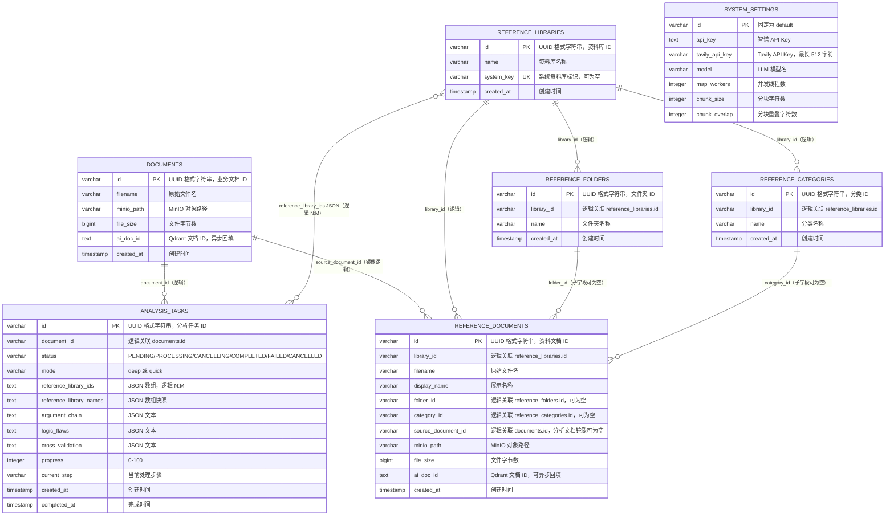
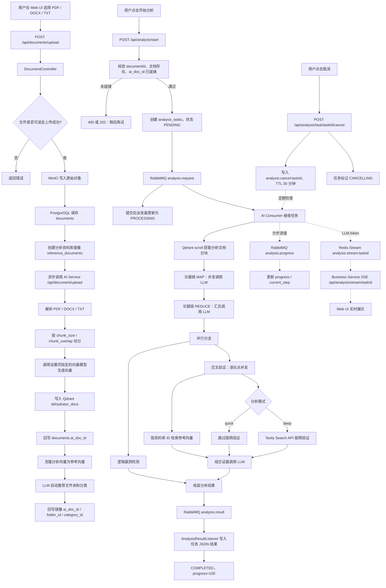
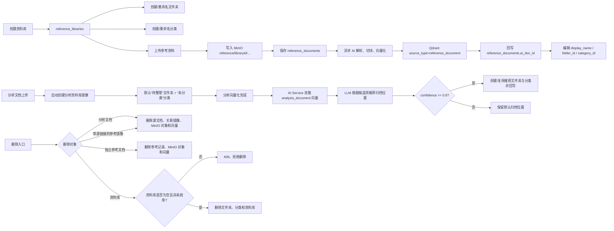
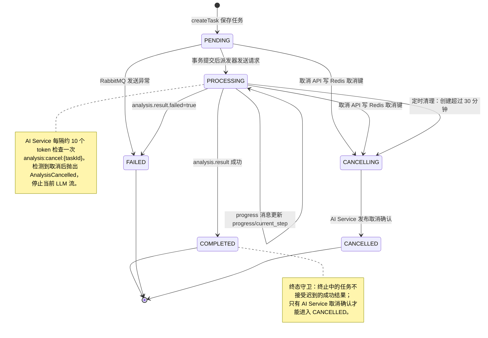
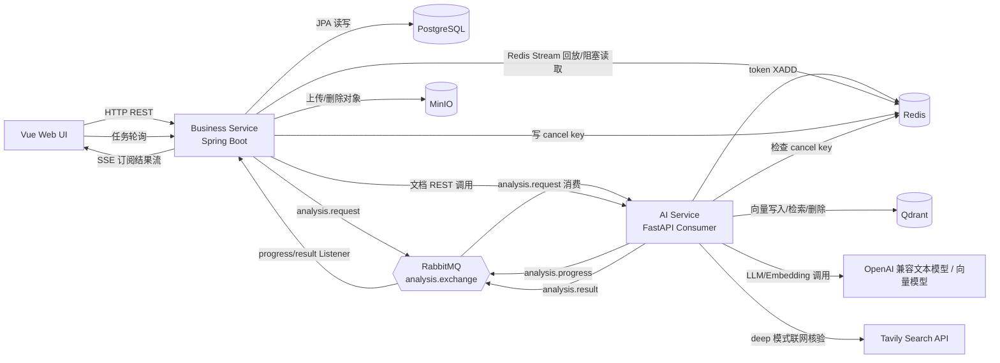

# The Dehydrator 系统图册

本文档依据当前仓库代码整理，覆盖 Web UI、Business Service、AI Service 以及 PostgreSQL、Redis、RabbitMQ、MinIO、Qdrant 的现状关系。

## 1. 阅读约定

- **ER 图**以 Spring Data JPA 实体为准。实体之间目前没有使用 `@ManyToOne`、`@OneToMany` 或 `@JoinColumn`，因此图中的大部分连线是业务逻辑上的关联，不代表 PostgreSQL 已创建物理外键。
- Spring Boot 的默认命名策略会把 Java 字段转换为下划线列名，例如 `documentId` 对应 `document_id`，`createdAt` 对应 `created_at`。
- 实体主键在 Java 中声明为 `String` 并使用 `GenerationType.UUID` 生成 UUID 格式字符串；代码没有显式声明 PostgreSQL `uuid` 类型，图中统一按 `varchar` 表示。
- `ai_doc_id` 是 AI Service/Qdrant 中的文档标识，与 PostgreSQL 的 `id` 不是同一个值。分析任务消息使用的是 `Document.ai_doc_id`。
- “控制图”在本文中指软件系统的控制流、状态控制、取消和超时控制，不是统计学意义上的质量控制图。

## 2. ER 图：PostgreSQL 业务实体



### 2.1 关系和约束说明

| 关系 | 当前实现 | 删除/一致性规则 |
| --- | --- | --- |
| `documents` -> `analysis_tasks` | `analysis_tasks.document_id` 字符串字段，代码按文档查询任务 | 删除文档时通过业务服务先删除资源；任务表没有实体级级联声明 |
| `reference_libraries` -> `reference_documents` | `reference_documents.library_id` 字符串字段 | 资料库只能删除空库；系统资料库 `AUTO_ANALYSIS_ARCHIVE` 不允许删除 |
| `reference_libraries` -> `reference_folders/categories` | 同一资料库内名称唯一 | 删除文件夹/分类前检查是否仍被资料引用 |
| `reference_documents` -> `documents` | `source_document_id` 用于分析文档自动归档镜像 | 删除源文档会删除所有镜像；删除带源文档链接的镜像会回溯删除源文档 |
| `analysis_tasks` -> `reference_libraries` | `reference_library_ids`、`reference_library_names` 为 JSON 文本，不是中间表 | 创建任务时清洗、去重 ID，并保存名称快照；交叉验证时按 ID 检索 Qdrant |
| `documents/reference_documents` -> MinIO | `minio_path` 保存对象键 | 删除时删除对应对象；镜像复用源文件路径，不重复上传对象 |
| `documents/reference_documents` -> Qdrant | `ai_doc_id` 异步回填 | 删除时调用 AI Service 删除同一 `doc_id` 的向量点 |

### 2.2 跨存储的向量实体

Qdrant 没有对应的 JPA 表，`dehydrator_docs` collection 中每个 point 的 payload 由 AI Service 写入：

```text
point_id    : UUID，Qdrant 点 ID
vector      : 设置页指定的 OpenAI 兼容向量模型输出
text        : 分块文本
doc_id      : AI 文档 ID，对应 documents.ai_doc_id 或 reference_documents.ai_doc_id
source_type : analysis_document 或 reference_document
library_id  : 参考资料所属资料库 ID，分析文档通常为空
```

分析文档归档为参考资料时，AI Service 会复制原分析文档的向量点，生成新的 `doc_id`，并将 `source_type` 改为 `reference_document`、写入 `library_id`；Business Service 再把新 ID 回填到镜像记录。

## 3. 流程图：文档上传到分析结果



### 3.1 主链路的关键分支

1. 文档上传返回的是 PostgreSQL 文档记录；向量化在后台异步执行，`ai_doc_id` 为空期间不能开始分析，异步回写受文档行锁和删除状态保护。
2. RabbitMQ 发送失败时，任务直接转为 `FAILED`，当前步骤为“任务提交失败”。
3. AI Service 的分析消费只读取 `source_type=analysis_document` 的向量，参考资料只在交叉验证阶段通过 `source_type=reference_document` 和 `library_id` 检索。
4. 快速模式不执行联网搜索；深度模式要求数据库已配置 Tavily API Key，并为每个论点调用 Tavily Search API。
5. Token 流和任务结果是两条不同通道：Token 走 Redis Stream + SSE（支持回放和 Last-Event-ID 续传），最终 JSON 结果走 RabbitMQ + PostgreSQL；任务终态会写回同一 Stream 收口 SSE。

## 4. 流程图：资料库与自动归档



## 5. 控制图：分析任务状态机



### 5.1 状态控制规则

| 控制点 | 实现位置 | 行为 |
| --- | --- | --- |
| 开始前置条件 | `AnalysisController.start` | `documentId` 必填，文档存在且 `ai_doc_id` 已回填；否则返回 400/202 |
| 状态进入处理中 | `AnalysisService.createTask` / `AnalysisTaskDispatcher` | 事务先保存 `PENDING`，提交后投递消息并更新 `PROCESSING` |
| 取消 | `AnalysisService.cancelTask` | `PENDING/PROCESSING` 进入 `CANCELLING`；Redis 取消键保留 30 分钟；AI 确认后才为 `CANCELLED` |
| 取消感知 | `stream_publisher.py` | 首 token 前、每 10 个 token、流结束后检查取消键 |
| 进度更新 | `AnalysisResultListener.onProgress` | 仅 `PROCESSING` 任务接受进度消息 |
| 结果幂等/迟到保护 | `AnalysisResultListener.onResult` | `COMPLETED`、`FAILED`、`CANCELLED` 任务跳过后续结果 |
| 超时 | `AnalysisService.cleanupTimedOutTasks` | 每 5 分钟扫描 `PENDING/PROCESSING` 且创建超过 30 分钟的任务并进入 `CANCELLING` |
| 并行度 | AI `argument_chain.py` / `cross_validation.py` | 使用线程池；`map_workers` 控制论据 MAP 与交叉验证的并发上限 |
| 消费背压 | AI `mq_consumer.py` | RabbitMQ consumer `prefetch_count=1`，单次只处理一个分析任务 |

## 6. 控制图：服务、消息和缓存控制通道



### 6.1 通道语义

| 通道 | 消息/键 | 生产者 -> 消费者 | 用途 |
| --- | --- | --- | --- |
| RabbitMQ 请求 | `analysis.request` | Business -> AI | 投递任务 ID、AI 文档 ID、模式、资料库 ID、模型配置及深度分析所需的 Tavily Key |
| RabbitMQ 进度 | `analysis.progress` | AI -> Business | 更新任务百分比和当前步骤 |
| RabbitMQ 结果 | `analysis.result` | AI -> Business | 保存三类分析 JSON，并将任务置为完成或失败 |
| Redis Stream | `analysis:stream:{taskId}` | AI/Business -> SSE -> UI | 保存批量 token、步骤、进度和终态事件，支持回放、续传、长度限制和 TTL |
| Redis 取消键 | `analysis:cancel:{taskId}` | Business -> AI | 协作式取消信号，TTL 30 分钟 |

## 7. 现状边界与后续数据库演进建议

- 当前 ER 里的逻辑外键没有数据库级约束，删除和引用校验依赖 `ReferenceArchiveService`、`ReferenceLibraryService` 等业务代码；若后续需要更强一致性，应评估补充 FK、索引和事务边界。
- `analysis_tasks.reference_library_ids` / `reference_library_names` 是 JSON 快照，优点是保留任务当时的资料库名称，缺点是无法直接做关系查询和级联校验。若需要审计或按资料库统计，建议新增 `analysis_task_reference_libraries(task_id, library_id, library_name_snapshot)` 中间表，并保留名称快照字段。
- `argument_chain`、`logic_flaws`、`cross_validation` 当前作为 TEXT 保存 JSON；如果需要按论点、漏洞类型或验证结论检索，建议拆出结果明细表或使用 PostgreSQL `jsonb` 加索引。
- 任务的“取消”是协作式的：业务服务先写 `CANCELLING` 和 Redis 信号，AI Service 在流式调用中检查并通过 RabbitMQ 回传确认，业务服务再进入 `CANCELLED`；取消请求与已经完成的结果并发到达时由任务行锁和终态守卫收口。
- Qdrant 与 PostgreSQL 没有跨存储事务。代码对删除和异步向量化采用补偿式清理；生产环境应增加失败重试、孤儿向量扫描和向量化失败状态字段。

## 8. 代码依据

- 数据实体：`Business_Service/src/main/java/com/arohtea/business_service/model/`
- 文档、分析与资料库服务：`Business_Service/src/main/java/com/arohtea/business_service/service/`
- RabbitMQ、Redis 通道：`Business_Service/src/main/java/com/arohtea/business_service/config/`、`AI_Service/services/mq_consumer.py`、`AI_Service/services/stream_publisher.py`
- AI 文档处理与分析：`AI_Service/api/routes/`、`AI_Service/services/`
- 前端 API 与任务页面：`Web_ui/src/api/index.js`、`Web_ui/src/views/AnalysisResult.vue`
