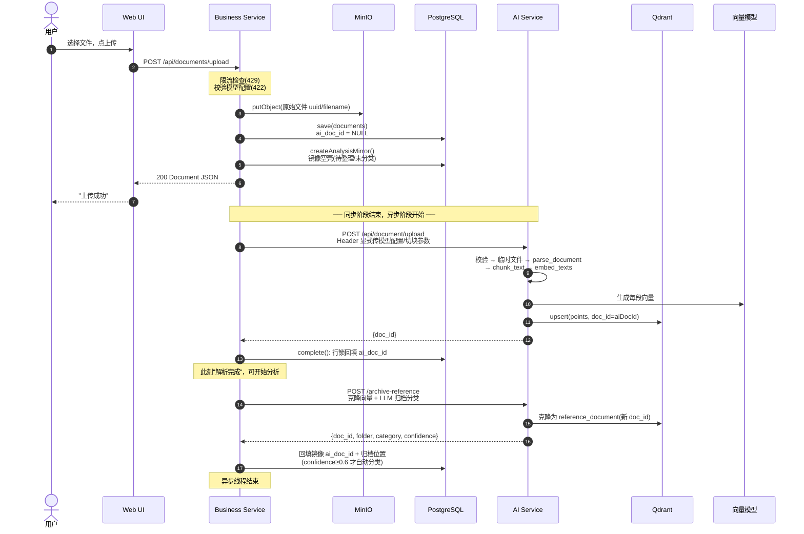
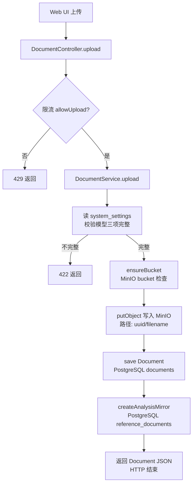
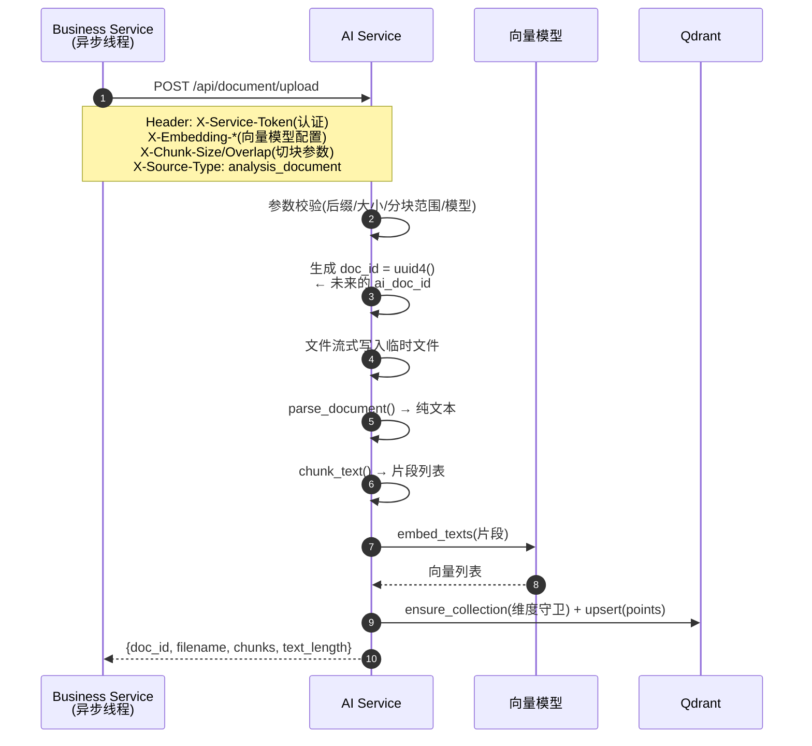
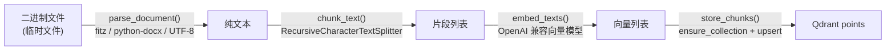
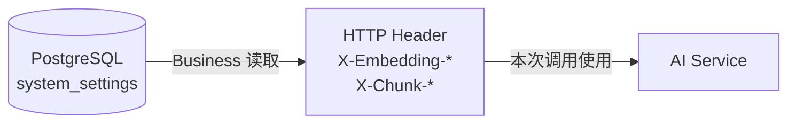
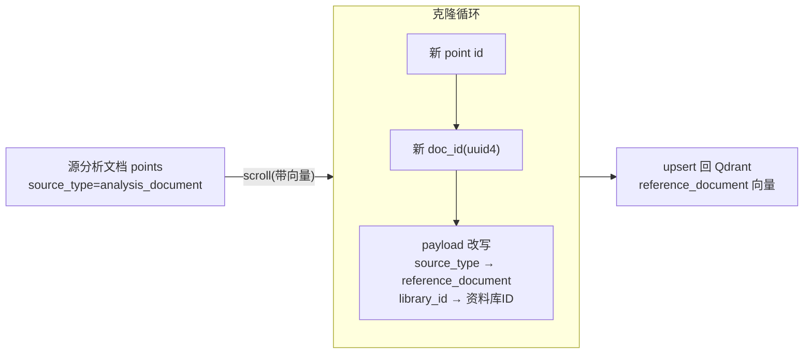
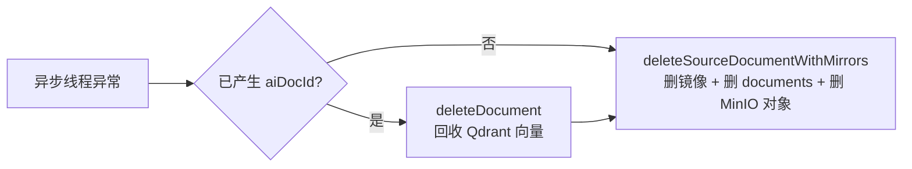
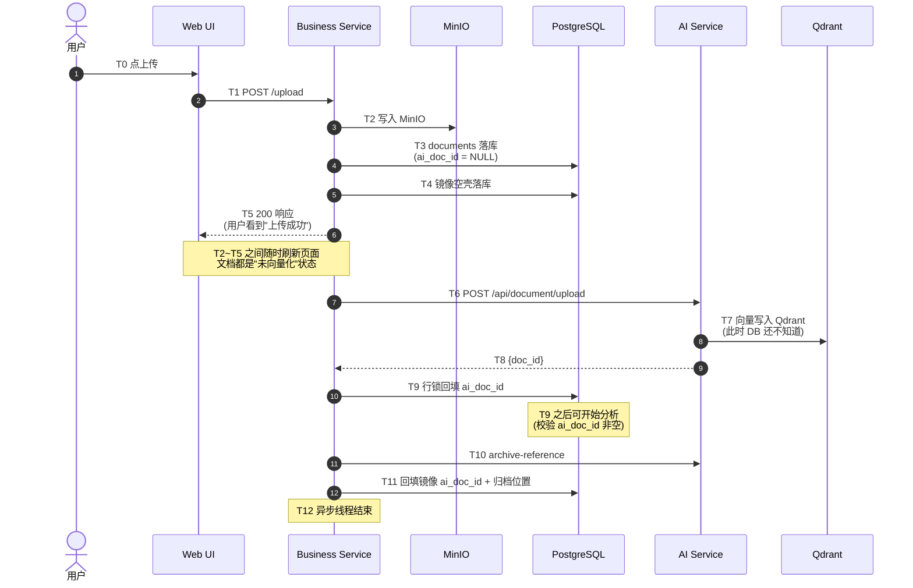

# 上传文档到解析完成：完整走读

本文档追踪"用户上传一个 PDF/DOCX/TXT，到文档可以被分析"的全部过程：
时间顺序、调用链、每一步经过哪些组件、数据以什么形态存在于哪里。
面向想真正读懂这条链路的开发者，建议对照代码逐段阅读（文末有代码索引）。

> 配套阅读：`docs/system-diagrams.md` 的"流程图：文档上传到分析结果"是这条链路的概要版；本文是逐行级的走读版。

---

## 0. 全链路总览

**最重要的认知：上传接口是"先响应、后干活"**。用户看到"上传成功"时，向量化根本还没发生。
文档的"解析完成"状态 = `documents.ai_doc_id` 已回填。



---

## 1. 阶段一：同步部分（HTTP 请求内完成）



### 1.1 这一步完成了什么

| 数据形态 | 存放在哪 | 说明 |
|---|---|---|
| 原始文件字节 | MinIO `{uuid}/{filename}` | 对象路径存进 `documents.minio_path` |
| 一行元数据 | PostgreSQL `documents` | `id`（业务文档 ID）、文件名、大小、`ai_doc_id = NULL` |
| 一行镜像元数据 | PostgreSQL `reference_documents` | 见 1.3 |

### 1.2 注意：这一步没有 AI 什么事

同步阶段完全在 Business Service 内部完成，不调用 AI Service。
向量化是从第 2 步的异步线程开始的。

### 1.3 顺带创建的"归档镜像"

`ReferenceArchiveService.createAnalysisMirror` 在 `documents` 落库后立刻执行：

- 找到（或创建）系统资料库 `AUTO_ANALYSIS_ARCHIVE`（"自动归档"）
- 确保资料库里有默认文件夹"待整理"、默认分类"未分类"
- 创建一条 `reference_documents` 记录，**复用同一个 MinIO 路径**（不重复存文件）

这条镜像此刻只是个空壳：`ai_doc_id` 为空，等向量化完成后才有实质内容（见阶段三）。

---

## 2. 阶段二：异步向量化（Business 后台线程 → AI Service）

`DocumentService.upload` 在返回前启动了 `CompletableFuture.runAsync(...)`，把下面的链条丢进线程池，
**不阻塞 HTTP 响应**：



### 2.1 AI 内部流水线：数据形态的变化

每一步的"数据形态变化"是这条链路的核心：



| 步骤 | 代码位置 | 关键行为 |
|---|---|---|
| 解析 | `document_parser.py` | PDF 用 PyMuPDF 逐页取文本；DOCX 取非空段落；TXT 按 UTF-8 读。解析失败 → 422 |
| 切块 | `chunking.py` | langchain `RecursiveCharacterTextSplitter`，按 `\n\n → \n → 。→ ；→ 空格` 优先级递归切分 |
| 嵌入 | `embedding.py` | 向量客户端按 `(model, url, key)` 三元组缓存，配置变了自动换新客户端 |
| 入库 | `vector_store.store_chunks` | 见 2.2 |

### 2.2 Qdrant 里的样子：片段是存储单元

每个片段是一个独立 point，通过 payload 拼出"逻辑文档"：

```text
point {
  id:      uuid4()          ← 片段级 ID，无业务含义
  vector:  [0.12, ...]      ← 向量模型输出
  payload: {
    text:        "片段原文"    ← 分析阶段取回的就是它
    doc_id:      "AI 文档 ID"  ← 逻辑文档边界，删除/检索都靠它
    source_type: "analysis_document"
    library_id:  null         ← 分析文档没有资料库
  }
}
```

`ensure_collection` 还有一个重要职责：**维度守卫**。向量模型输出维度一旦与现有集合不符（换过模型），直接报错拒绝写入，避免产生不可检索的脏数据。

### 2.3 配置从哪来：显式传递，不落 AI

AI Service **不读任何模型环境变量**（CLAUDE.md 配置原则）。所有模型配置和切块参数由 Business
从数据库 `system_settings` 读出，通过 HTTP Header 显式传入：



好处：一次上传全链路用同一份配置快照（不会因为设置页被改而中途漂移）；AI 保持无状态、无配置回退。

---

## 3. 阶段三：回填与归档（异步线程的收尾）

AI 返回 `doc_id` 后，Business 异步线程继续：

```mermaid
flowchart TD
    R["AI 返回 {doc_id}"] --> C[DocumentVectorizationService.complete]
    C --> C1{@Transactional + 行锁<br/>文档存在 && 未进入删除流程?}
    C1 -- 否 --> X["返回 null →<br/>deleteDocument 回收刚写入的向量<br/>(防止删除后旧回调复活文档)"]
    C1 -- 是 --> C2[setAiDocId + save]
    C2 --> F[ReferenceArchiveService.finalizeAnalysisMirror]
    F --> F1[取资料库现有文件夹/分类<br/>作为候选]
    F1 --> F2[archiveReferenceDocument<br/>→ AI 克隆向量 + LLM 推荐]
    F2 --> F3{confidence >= 0.6?}
    F3 -- 是 --> F4[自动创建/复用推荐<br/>文件夹与分类并回写镜像]
    F3 -- 否 --> F5[保留默认归档位置<br/>待整理/未分类]
    F4 --> DONE["回填镜像 ai_doc_id<br/>log: 文档向量化完成"]
    F5 --> DONE
```

### 3.1 镜像的"克隆"：向量复制，不是文件复制

`archive-reference` 调用的核心是 `clone_analysis_document_to_reference`（`vector_store.py`）：



所以：**同一份文件（MinIO 一个对象），两套向量（分析 + 参考）**。镜像在文件层面复用，
在向量层面是独立的。这就是"删除分析文档会级联删镜像"但"资料库检索不会命中原分析文档"的原因。

LLM 分类用 `_preview_text` 只取前 6 个片段、5000 字符做上下文（控制成本），
建议经 `parse_and_validate` 结构校验，失败时降级为默认归档位置，不影响主链路。

### 3.2 失败路径：补偿式清理

异步线程捕获任何异常后：



目标：**不留孤儿资源**。因为 PostgreSQL、Qdrant、MinIO 三者之间没有跨存储事务，
只能靠代码兜底。

---

## 4. 时间流全景（带各时刻状态）



**T5~T9 之间有任何一秒，用户都能看到"文档存在但 ai_doc_id 为空"**——这就是
`POST /api/analysis/start` 对未就绪文档返回 400/202"稍后再试"的原因（`AnalysisController`）。

---

## 5. 三个 ID，别搞混（本系统最容易踩的坑）

| ID | 谁生成 | 存哪 | 用途 |
|---|---|---|---|
| `documents.id` | Business（UUID） | PostgreSQL | 业务文档 ID，前端/接口层使用 |
| `ai_doc_id` | AI Service（UUID） | `documents.ai_doc_id` 回填 | AI/Qdrant 侧逻辑文档 ID，**分析任务消息用的是它** |
| Qdrant point id | AI Service（UUID） | 仅 Qdrant | 片段级 ID，无业务含义 |

关键推论：

- 两个 UUID 没有换算关系，互不可推
- `ai_doc_id` 为空 ⇔ 文档还没解析完成 ⇔ 不能开始分析
- 删除向量按 `payload.doc_id` 过滤（一个调用清整个文档），不按 point id
- 镜像有**第四套** ID：`reference_documents.id` + 克隆出的新 `ai_doc_id`（与源文档完全不同）

---

## 6. 每一步的代码索引

| 步骤 | 代码 |
|---|---|
| 上传入口 + 限流 | `Business_Service/.../controller/DocumentController.java:32` |
| 上传编排（MinIO/DB/异步线程） | `Business_Service/.../service/DocumentService.java:56` |
| 模型配置校验 | `Business_Service/.../service/SystemSettingsService.java`（`require*ModelConfig`） |
| 创建归档镜像 | `Business_Service/.../service/ReferenceArchiveService.java:58` |
| 内部 HTTP 客户端（Header 传配置） | `Business_Service/.../client/AiServiceClient.java:79` |
| AI 上传接口（校验/解析/切块/入库） | `AI_Service/api/routes/document.py:37` |
| 解析器（PDF/DOCX/TXT） | `AI_Service/services/document_parser.py:57` |
| 切块 | `AI_Service/services/chunking.py:6` |
| 向量化（客户端缓存） | `AI_Service/services/embedding.py:11` |
| Qdrant 写入 + 维度守卫 | `AI_Service/services/vector_store.py:33` / `:125` |
| 回填 ai_doc_id（行锁防复活） | `Business_Service/.../service/DocumentVectorizationService.java:23` |
| 克隆向量为参考 | `AI_Service/services/vector_store.py:249` |
| LLM 归档分类 | `AI_Service/services/reference_archive.py:63` |
| 归档回写（置信度阈值） | `Business_Service/.../service/ReferenceArchiveService.java:87` |

---

## 7. 快速自测（读完能答出这些，就算通了）

1. 用户点上传到"上传成功"，这段时间里 AI Service 参与了吗？→ 没有，纯 Business 内部。
2. 文档上传成功但 `ai_doc_id` 还是空，能开始分析吗？→ 不能，400/202。
3. `documents.id` 和 `ai_doc_id` 相等吗？→ 不相等，各自生成、无换算关系。
4. 镜像的向量和源文档的向量是同一份吗？→ 不是，是克隆（新 doc_id、新 point id），但 MinIO 文件是同一个。
5. AI 不读环境变量，它的模型配置从哪来？→ Business 从 DB 读出，经 HTTP Header 显式传入。
6. 向量化中途失败会怎样？→ 尽力删掉已写向量，再删 DB 记录和 MinIO 对象，不留孤儿。
7. "解析完成"的判定时刻是什么？→ `DocumentVectorizationService.complete` 行锁回填 `ai_doc_id` 成功。
